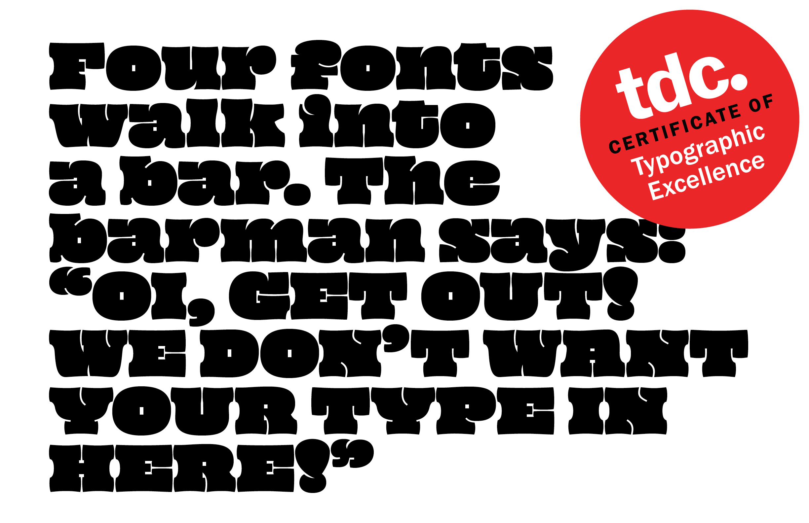
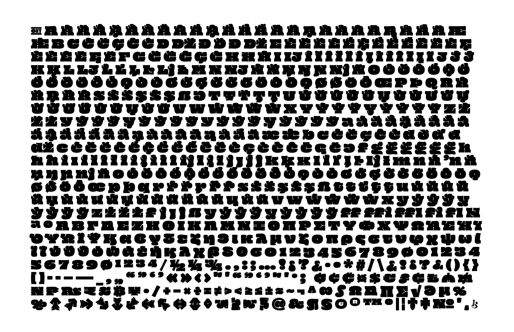

# Oi!
Oi is a display typeface designed by Kostas Bartsokas.
 

## Basic Information
Oi! is an ultra-fat display typeface that has its roots in grotesque slab serifs, most specifically the style that sprung with the release of Caslon’s Ionic in 1844 and Clarendon by Fann Street Foundry in 1845.

Oi! is a free spirited twisted interpetation of the clarendonesques. With an unapologetic tendecy for public shouting, it is a whimsical loudmouth attention seeker!

Oi is an interjection used in various languages. Its meaning varies, depending on the tone and abruptness of its use, from a simple “hi” or a call of attention to as far as a challenge to a fight.

Oi! supports the Google Latin Plus, Latin Pro, Cyrillic Plus, Cyrillic Plus .locl, Cyrillic Pro, and Greek Core character sets.

Read more about [the story of Oi!](https://blog.usejournal.com/the-story-of-oi-508d7027e67b)

This typeface project received financial support from Google, and in the future may be available in Google Fonts.

**Character Set**
 

**Some cool opentype features**
 

**Language Support**
<details>
<summary>Expand</summary>
<p>
Latin: Abenaki, Afaan Oromo, Afar, Afrikaans, Albanian, Alsatian, Amis, Anuta, Aragonese, Aranese, Aromanian, Arrernte, Arvanitic, Asturian, Atayal, Aymara, Azerbaijani, Bashkir, Basque, Belarusian, Bemba, Bikol, Bislama, Bosnian, Breton, Cape Verdean, Catalan, Cebuano, Chamorro, Chavacano, Chichewa, Chickasaw, Cimbrian, Cofan, Cornish, Corsican, Creek, Crimean Tatar, Croatian, Czech, Danish, Dawan, Delaware, Dholuo, Drehu, Dutch, English, Esperanto, Estonian, Faroese, Fijian, Filipino, Finnish, Folkspraak, French, Frisian, Friulian, Gagauz, Galician, Ganda, Genoese, German, Gikuyu, Gooniyandi, Greenlandic, Greenlandic Old Orthography, Guadeloupean, Gwichin, Haitian Creole, Han, Hawaiian, Hiligaynon, Hopi, Hotcak, Hungarian, Icelandic, Ido, Igbo, Ilocano, Indonesian, Interglossa, Interlingua, Irish, Istroromanian, Italian, Jamaican, Javanese, Jerriais, Kaingang, Kala Lagaw Ya, Kapampangan, Kaqchikel, Karakalpak, Karelian, Kashubian, Kikongo, Kinyarwanda, Kiribati, Kirundi, Klingon, Kurdish, Ladin, Latin, Latino Sine, Latvian, Lithuanian, Lojban, Lombard, Low Saxon, Luxembourgish, Maasai, Makhuwa, Malay, Maltese, Manx, Maori, Marquesan, Meglenoromanian, Meriam Mir, Mirandese, Mohawk, Moldovan, Montagnais, Montenegrin, Murrinhpatha, Nagamese Creole, Nahuatl, Ndebele, Neapolitan, Ngiyambaa, Niuean, Noongar, Norwegian, Novial, Occidental, Occitan, Old Icelandic, Old Norse, Oshiwambo, Ossetian, Palauan, Papiamento, Piedmontese, Polish, Portuguese, Potawatomi, Qeqchi, Quechua, Rarotongan, Romanian, Romansh, Rotokas, Sami Inari, Sami Lule, Sami Northern, Sami Southern, Samoan, Sango, Saramaccan, Sardinian, Scottish Gaelic, Serbian, Seri, Seychellois, Shawnee, Shona, Sicilian, Silesian, Slovak, Slovenian, Slovio, Somali, Sorbian Lower, Sorbian Upper, Sotho Northern, Sotho Southern, Spanish, Sranan, Sundanese, Swahili, Swazi, Swedish, Tagalog, Tahitian, Tetum, Tok Pisin, Tokelauan, Tongan, Tshiluba, Tsonga, Tswana, Tumbuka, Turkish, Turkmen, Tuvaluan, Tzotzil, Ukrainian, Uzbek, Venetian, Vepsian, Vietnamese, Volapuk, Voro, Wallisian, Walloon, Waraywaray, Warlpiri, Wayuu, Welsh, Wikmungkan, Wiradjuri, Wolof, Xavante, Xhosa, Yapese, Yindjibarndi, Zapotec, Zazaki, Zulu, Zuni
<p>
Greek: Monotonic Modern Greek.
<p>
</details>  

## Building the fonts

### Step 1: Install Requirements

Set up a virtual environment in the root directory:

```
virtualenv -p python3 venv
```

Activate the virtual environment with:

```
source venv/bin/activate
```

Install requirements with:

```
pip install -U -r requirements.txt
```

### Step 2: Build the fonts

**Building the fonts**

The script for building the fonts is in the `/sources/` folder.

To build a static ttf run:

```
cd sources
sh build.sh
```

If you want to build otf's do so through Glyphs using the source Glyphs file. 

## ChangeLog

This is version 2.000. Compared to the previous commercial version of the font (v.1.000) it introduces Vietnamese support.

## License

Oi is licensed under the SIL Open Font License v1.1 (<http://scripts.sil.org/OFL>).

